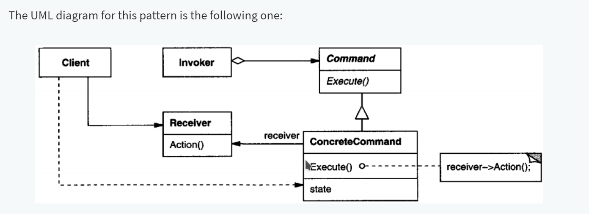

# Command Pattern

### Definition -1

In object-oriented programming, the command pattern is a behavioral design pattern in which an object is used to encapsulate all information needed to perform an action or trigger an event at a later time. This information includes the method name, the object that owns the method and values for the method parameters  — Wikipedia

### Definition -2

Encapsulate a request as an object, thereby letting you parameterize clients with different requests, queue or log requests, and support undoable operations - Design Patterns: Elements of Reusable Object-Oriented Software

### Basic Idea

In this pattern an abstract Command class is declared as an interface for executing operations. The Command class defines a method named execute, which must be implemented in each concrete command. This execute method is a bridge between a Receiver object and an action. The Receiver knows how to perform the operations associated with a request (any class may be a Receiver). Another relevant component in this pattern is the Invoker class which asks for the command that must be executed.

## Command Pattern: When To Use

- You need a command to have a life span independent of the original request. Furthermore, if you want to queue, specify and execute requests at different times.
- You need undo/redo operations. The command's execution can be stored for reversing its effects. It is important that the Command class implements the methods undo and redo.
- You need to structure a system around high-level operations built on primitive operations.

## Command Pattern: Advantages

1. It decouples the classes that invoke the operation from the object that knows how to execute the operation
2. It allows you to create a sequence of commands by providing a queue system
3. Implementing extensions to add a new command is easy and can be done without changing the existing code.
4. You can also define a rollback system with the Command pattern, like in the Wizard example, we could write a rollback method.
5. Have strict control over how and when commands are invoked.
6. The code is easier to use, understand and test since the commands simplify the code.

# References

[Command Pattern - Carlos Caballero](https://www.carloscaballero.io/design-patterns-command/)
